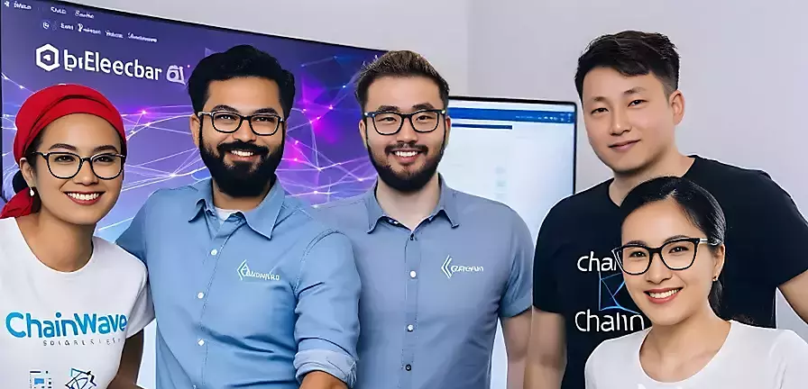

# Welcome to Chainwave's Team :chains:

Welcome to the official GitHub page of the Chainwave team! We are at the forefront of blockchain innovation, meticulously crafting projects that push the boundaries of NFTs and decentralized applications. Our journey through Solana, Ethereum, and now the Sei blockchain, has been nothing short of adventurous. Dive into our world where code meets creativity.

## :compass: Our Mission

At Chainwave, we believe in a future where blockchain technology is integral to society. Our mission is to construct secure, transparent, and groundbreaking digital experiences that empower users and redefine industry standards.

## :dart: Our Goals

- **Innovate:** To be the architects of the industry's most reliable and inventive blockchain solutions.
- **Educate:** To share our knowledge and insights, fostering a community of informed blockchain enthusiasts.
- **Collaborate:** To nurture strong partnerships and build a network of like-minded pioneers in the blockchain space.

### My GitHub Stats

# Blog posts
<!-- BLOG-POST-LIST:START -->
<!-- BLOG-POST-LIST:END -->

# Recently Improved Techs
- [DenoJS](https://deno.com)
- [HoneypotJS for Honeypot Detector](https://honeypot.is/)
- [BunJS](https://bun.sh)
- [Segment Anything(AI)](https://segment-anything.com)

# Recently Read Acticles
- [A Golang based simple, easy-to-use, elegant open-source Home Cloud system](https://golang.ch/a-golang-based-simple-easy-to-use-elegant-open-source-home-cloud-system/?ref=dailydev)
- [Leveraging React Render Props for Flexible Component Composition](https://www.dhiwise.com/post/leveraging-react-render-props-for-flexible-component-composition)
- [AI for Game Development](https://huggingface.co/blog/ml-for-games-1?ref=dailydev)
- [An NFT without a Blockchain. No gas fees. No Eth. No gatekeepers](https://shkspr.mobi/blog/2021/12/an-nft-without-a-blockchain-no-gas-fees-no-eth/?ref=dailydev)

---

Pioneering the blockchain vista, Chainwave continues to seek the uncharted territories in the vast expanse of digital possibility.

Join us! Let's innovate collectively for a decentralized tomorrow. 🚀

